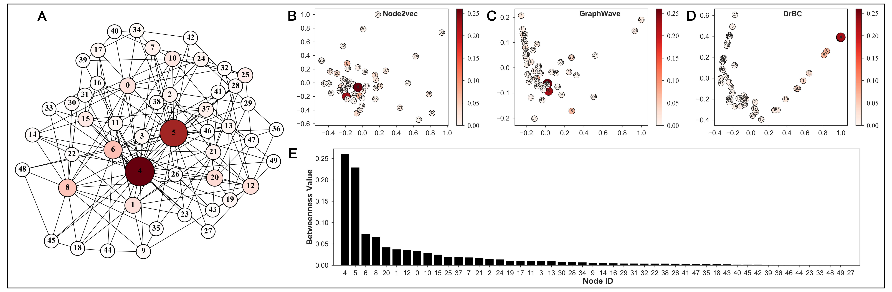

# DrBC++
A graph neural network approach to identify high Betweenness Centraliy in a graph

This work is based on the initial DrBC project:
Fan, Changjun and Zeng, Li and Ding, Yuhui and Chen, Muhao and Sun, Yizhou and Liu, Zhong[[Learning to Identify High Betweenness Centrality Nodes from Scratch: A Novel Graph Neural Network Approach]](http://arxiv.org/abs/1905.10418) (CIKM 2019)


Original implementation: https://github.com/FFrankyy/DrBC/


The code folder is organized as follows:

* __cpp/__: contains all the .cpp and .h files:
    + __cpp/PrepareBatchGraph.cpp__: Prepare the batch graphs used in the tensorflow codes.
    + __cpp/graph.cpp__: basic structure for graphs.
    + __cpp/graphUtil.cpp__: Compute the collective influence functions.
    + __cpp/graph_struct.cpp__: Linked list data structure for sparse graphs.
    + __cpp/metrics.cpp__: Compute the metrics functions such as topk accuracy and kendal tau distance. 
    + __cpp/utils.cpp__: Compute nodes' betweenness centrality.
* __drbcpp/__: contains all the python files for the training and model definition
* __drbcython/__: contains the python bindings for c++ files defined in __cpp/__
* __visualize/__: contains the figures used in the paper
* __experiments/__: Will contain all the experiments in the chronological order (including models and logs)


## To run the project
Get the source code, and install all the dependencies.
```
git clone https://github.com/MartinXPN/DrBCPP.git
cd DrBCPP && pip install .
```

## Training
Adjust hyper-parameters in `start.py`, and run the following to train the model
```
python start.py
```


## Reproducing the results that reported in the paper
Here is the link to the dataset that was used in the paper:
```
TODO
```

To run the evaluation and get the results
```shell script
predict.py real --model_path experiments/<DATE>/models/best.h5py --data_test Data/Real/amazon.txt --label_file Data/Real/exact_bc/amazon.txt
```


## Baselines implementations
For RK and k-BC, we use the following implementations:
```
https://github.com/ecrc/BeBeCA
```
For KADABRA, we use:
```
https://github.com/natema/kadabra
```
For ABRA, we use the codes in the original paper.
For node2vec, we use:
```
https://github.com/snap-stanford/snap/tree/master/examples/node2vec
```

## References
To cite our work:
```
TODO
```

To cite the initial work [https://github.com/FFrankyy/DrBC](https://github.com/FFrankyy/DrBC)
```
@inproceedings{fan2019learning,
  title={Learning to Identify High Betweenness Centrality Nodes from Scratch: A Novel Graph Neural Network Approach},
  author={Fan, Changjun and Zeng, Li and Ding, Yuhui and Chen, Muhao and Sun, Yizhou and Liu, Zhong},
  booktitle={Proc. 2019 ACM Int. Conf. on Information and Knowledge Management (CIKM’19)},
  year={2019},
  organization={ACM}
}
```
